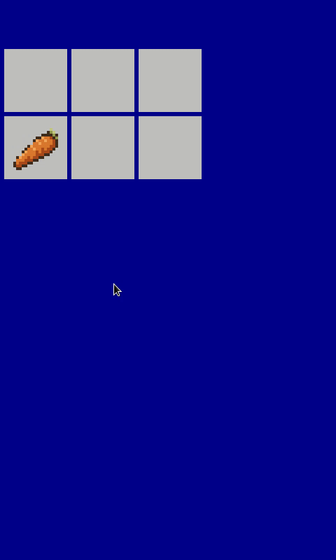

# chickenpy
Object-oriented cooking simulator  

Currently: simple snap-to-grid inventory system with custom sprites!



## dev  

Uses [uv](https://docs.astral.sh/uv/) for project management.  

Linting and formatting:  

```bash
uvx ruff check --select I --fix
uvx ruff format
```

## Acknowledgements  

| Asset                          | Author                                          | Licence |
| ------------------------------ | ----------------------------------------------- | ------- |
| Tiny Swords                    | [Pixel Frog](https://pixelfrog-assets.itch.io/) | CC0     |
| FantasyStuffs - Basic food RPG | [Cruelus-Rex](https://cruelus-rex.itch.io/)     |         |
